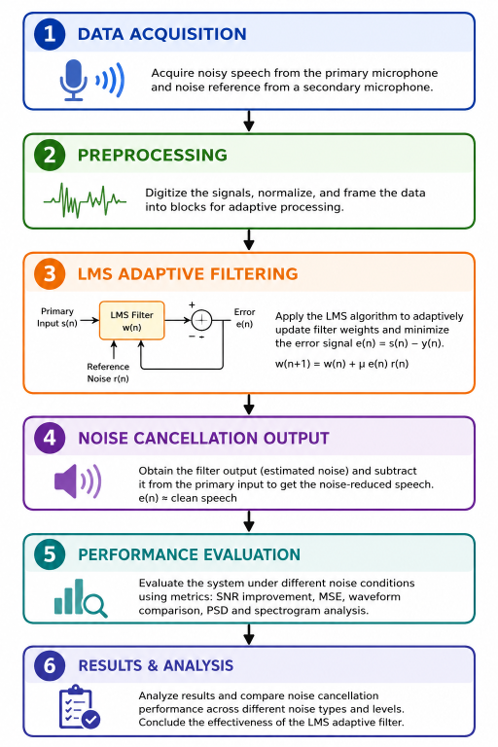

# Adaptive-Noise-Cancellation-using-STM32
An LMS-based Adaptive Noise Cancellation system for speech enhancement using MATLAB and STM32F407VG. The system dynamically removes background noise using dual-microphone inputs, achieving an SNR improvement of 6.27 dB and stable convergence, making it suitable for real-time embedded DSP applications.

# Overview
In real-world environments, speech signals are often corrupted by unwanted background noise originating from traffic, machinery, crowded places, and electronic interference. This degradation significantly affects the performance of communication systems, hearing aids, voice assistants, teleconferencing platforms, and speech recognition applications.

This project presents an Adaptive Noise Cancellation (ANC) system based on the Least Mean Squares (LMS) adaptive filtering algorithm to enhance speech quality in dynamically changing noise environments. Unlike conventional fixed filters, the LMS algorithm continuously updates its filter coefficients in real time, enabling effective suppression of non-stationary background noise.

The proposed system employs a dual-input microphone architecture, where:

The primary input contains the desired speech signal mixed with ambient noise.
The reference input captures only the noise component.

Using the LMS adaptation process, the system estimates the noise signal and subtracts it from the corrupted speech, resulting in a cleaner and more intelligible output signal.

The project was developed and evaluated in MATLAB, with performance assessed using Signal-to-Noise Ratio (SNR), Mean Square Error (MSE), waveform analysis, Power Spectral Density (PSD), and spectrogram analysis. Experimental results demonstrated a significant SNR improvement of 6.27 dB, increasing the speech quality from 0.12 dB to 6.39 dB, while achieving a low steady-state error of 7.23 × 10⁻⁵.

## 🛠️ Tools Used

### MATLAB
MATLAB was used as the primary development and simulation environment for implementing the LMS adaptive filtering algorithm. It was utilized for generating noisy speech signals, adaptive filter design, performance evaluation, and visualization through waveform, power spectral density (PSD), and spectrogram analysis.

### STM32F407VG DISC1
The STM32F407VG DISC1 development board, based on the ARM Cortex-M4 processor with a floating-point unit (FPU), was selected as the target hardware platform for real-time implementation of the adaptive noise cancellation system.

### STM32CubeIDE
STM32CubeIDE was used for firmware development, debugging, code compilation, and integration of DSP algorithms on the STM32 microcontroller.

### STM32CubeMX
STM32CubeMX was employed for peripheral configuration and automatic code generation, simplifying the setup of hardware resources required for embedded implementation.

### ARM CMSIS-DSP Library
The ARM CMSIS-DSP library provides optimized digital signal processing functions for Cortex-M processors. The `arm_lms_norm_f32` function can be utilized for efficient real-time implementation of the LMS adaptive filtering algorithm.

---

## ⚙️ Techniques Used

### Least Mean Squares (LMS) Adaptive Filtering
The LMS algorithm is an iterative adaptive filtering technique that continuously updates filter coefficients to minimize the error between the desired signal and the filter output. Its low computational complexity and stable convergence make it highly suitable for real-time noise cancellation applications.

### Adaptive Noise Cancellation (ANC)
Adaptive Noise Cancellation employs a dual-input approach in which one signal contains speech corrupted by noise while another provides a reference noise input. The adaptive filter estimates the noise component and subtracts it from the primary signal to recover clean speech.

### Digital Signal Processing (DSP)
DSP techniques were applied for speech signal acquisition, preprocessing, filtering, and analysis in both time and frequency domains.

### Performance Evaluation
The effectiveness of the proposed system was evaluated using:
- **Signal-to-Noise Ratio (SNR)** to quantify speech enhancement performance.
- **Mean Square Error (MSE)** to analyze convergence and filter accuracy.

### Signal Analysis Techniques
Time-domain waveform analysis, Welch Power Spectral Density (PSD), and spectrogram analysis were used to visually verify noise suppression and preservation of important speech components.

## IV. WORKING METHODOLOGY

The proposed Adaptive Noise Cancellation (ANC) system is developed using the Least Mean Squares (LMS) adaptive filtering algorithm to enhance speech quality in noisy environments. The complete implementation consists of two stages: MATLAB-based simulation and real-time embedded implementation on the STM32F407VG DISC1 microcontroller.

### A. Audio Acquisition and Signal Generation

Initially, a clean speech audio signal and a separate noise signal are imported into MATLAB. The noise signal may consist of white noise, Gaussian noise, or environmental noise recordings. These two signals are combined to generate a **primary input signal**, represented as

\[
d(n)=s(n)+v(n)
\]

where:

- \(s(n)\) = desired clean speech signal
- \(v(n)\) = unwanted background noise

A reference noise signal \(x(n)\), correlated with the noise present in the primary signal, is also provided to the adaptive filter.

### B. LMS Adaptive Filtering

The LMS adaptive filter continuously updates its filter coefficients to estimate the noise component present in the corrupted speech signal. The filter output is given by

\[
y(n)=w^T(n)x(n)
\]

where:

- \(w(n)\) = adaptive filter coefficient vector
- \(x(n)\) = reference noise input

The error signal, which represents the recovered speech signal, is calculated as

\[
e(n)=d(n)-y(n)
\]

The filter coefficients are iteratively updated using the LMS weight update equation:

\[
w(n+1)=w(n)+2\mu e(n)x(n)
\]

where \(\mu\) is the step size parameter controlling the convergence speed and stability of the algorithm.

Through successive iterations, the filter minimizes the mean square error and effectively suppresses background noise while preserving the desired speech components.

### C. Conversion to Embedded Format

For hardware implementation, the audio samples are converted into header (`.h`) files containing numerical sample arrays. This conversion enables the microcontroller to directly access the audio data in a machine-readable format.

Python scripts are utilized for importing audio files, converting them into C-compatible arrays, and exporting the processed data. Python provides flexibility since it does not impose significant limitations on audio file handling.

### D. Real-Time Implementation on STM32

The embedded implementation is carried out on the **STM32F407VG DISC1** development board based on the ARM Cortex-M4 processor.

The ARM CMSIS-DSP library provides optimized implementations of adaptive filtering algorithms. The LMS filtering operation is performed using the built-in normalized LMS function:

```c
arm_lms_norm_f32()
```

This function performs adaptive coefficient updates efficiently and is highly suitable for real-time DSP applications on resource-constrained embedded systems.

Due to memory limitations of the STM32 platform, audio duration is restricted to approximately **3 seconds** for real-time processing. After compiling and uploading the firmware using STM32CubeIDE, the processed speech output can be obtained through the onboard audio interface or audio jack, where the background noise is significantly reduced.

### E. Performance Evaluation

The effectiveness of the proposed system is evaluated using both objective and visual performance metrics.

#### 1) Signal-to-Noise Ratio (SNR)

The improvement in speech quality is quantified using Signal-to-Noise Ratio (SNR). Experimental results showed:

- Input SNR = **0.12 dB**
- Output SNR = **6.39 dB**
- SNR Improvement = **6.27 dB**

The considerable increase in SNR demonstrates effective suppression of background noise.

#### 2) Mean Square Error (MSE)

The convergence behavior of the adaptive filter is evaluated using Mean Square Error (MSE). The LMS algorithm achieved a steady-state error of

\[
\text{SS-MSE}=7.23\times10^{-5}
\]

indicating stable convergence and accurate estimation of the noise component.

#### 3) Time-Domain Analysis

Waveform comparisons between the original speech, noisy speech, and filtered output indicate that the recovered signal closely resembles the clean speech waveform with significantly reduced noise components.

#### 4) Frequency-Domain Analysis

Welch Power Spectral Density (PSD) analysis confirms attenuation of unwanted frequency components while preserving important speech frequencies.

#### 5) Spectrogram Analysis

Spectrogram comparisons further verify successful suppression of background noise without introducing noticeable spectral distortion, thereby ensuring high-fidelity speech reconstruction.

Overall, the proposed LMS-based Adaptive Noise Cancellation system demonstrates low computational complexity, reliable convergence characteristics, and suitability for real-time embedded speech enhancement applications.

### 🧩 Working Methodology


# Result 
The LMS-based Adaptive Noise Cancellation (ANC) system was successfully implemented and evaluated using MATLAB simulations and prepared for real-time deployment on the STM32F407VG DISC1 platform.

### A. Noise Suppression Performance

The adaptive filter effectively removed background noise from the corrupted speech signal while preserving the essential characteristics of the original speech. The recovered speech output exhibited significantly improved clarity and intelligibility compared to the noisy input signal.

The objective performance metrics obtained are summarized below:

- **Input SNR:** 0.12 dB
- **Output SNR:** 6.39 dB
- **SNR Improvement (ΔSNR):** 6.27 dB
- **Steady-State Mean Square Error (SS-MSE):** \(7.23 \times 10^{-5}\)

The substantial increase in Signal-to-Noise Ratio demonstrates the capability of the LMS algorithm to effectively suppress background noise under varying noise conditions.

### B. Convergence Characteristics

The convergence curve of the LMS adaptive filter indicates that the filter coefficients gradually adapt to the noise environment and eventually reach a stable operating condition. The low steady-state MSE value confirms stable convergence and accurate estimation of the noise component.

Furthermore, the normalized LMS implementation ensures computational efficiency and prevents divergence during coefficient adaptation.

### C. Time-Domain Analysis

Time-domain waveform comparisons between the original speech signal, noisy speech signal, and filtered output reveal that the adaptive filter successfully reconstructs the desired speech signal. The amplitude variations caused by background noise are considerably reduced after filtering.

The filtered waveform closely resembles the original clean speech waveform, indicating effective noise cancellation with minimal distortion.

### D. Frequency-Domain Analysis

Power Spectral Density (PSD) analysis demonstrates noticeable attenuation of unwanted frequency components introduced by ambient noise. Important speech frequency components are preserved, ensuring that speech intelligibility is maintained after filtering.

### E. Spectrogram Analysis

Spectrogram comparisons further validate the effectiveness of the proposed approach. The noisy speech signal exhibits high spectral energy distributed across various frequency bands due to background interference. After LMS filtering, a significant reduction in noise energy can be observed while retaining the dominant speech features.

This confirms that the adaptive filter suppresses noise without introducing significant spectral distortion.

### F. Discussion

The experimental results demonstrate that the LMS adaptive filtering approach provides:

- Effective suppression of background noise.
- Improved speech quality and intelligibility.
- Stable convergence characteristics.
- Low computational complexity suitable for embedded implementation.
- Compatibility with real-time DSP systems based on ARM Cortex-M processors.

Overall, the proposed Adaptive Noise Cancellation system successfully achieves real-time speech enhancement and serves as a strong foundation for future implementations involving advanced adaptive algorithms such as NLMS, FxLMS, and neural adaptive filtering techniques.

[RESULT.md](RESULT.md)

# Future Scope
- Implementation of advanced adaptive algorithms such as **NLMS, FxLMS, and RLS** for faster convergence and improved noise suppression.
- Integration of **Deep Learning and AI-based speech enhancement techniques** for handling highly non-stationary noise environments.
- Development of a complete **real-time embedded system** using microphones and external audio peripherals.
- Extension to **multi-channel microphone arrays and beamforming techniques** for enhanced spatial noise cancellation.
- Deployment in applications such as **hearing aids, voice assistants, telecommunication systems, biomedical signal processing, and smart IoT devices**.
- Support for **long-duration and streaming audio processing** through external memory and high-performance DSP platforms.


